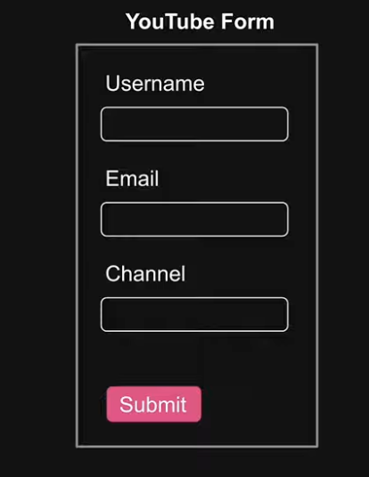

# React-hook-form Tutorial

- [React-hook-form Tutorial](#react-hook-form-tutorial)
  - [React fundamentals and advanced topics](#react-fundamentals-and-advanced-topics)
  - [Forms](#forms)
  - [React Hook Form](#react-hook-form)
    - [What?](#what)
    - [Why?](#why)
    - [How?](#how)
  - [Prerequisites](#prerequisites)
  - [Form Setup](#form-setup)
  - [Project Setup](#project-setup)

<br/>

## React fundamentals and advanced topics

---

- React hooks
- React typescript
- React redux
- React router
- React resting
- React material UI
- React styled components
- React storybook
- React query
- React table
- React formik
- React render

<br/>

## Forms

---
Crucial aspect of any business application

- Users
  - Registering
  - Loggin in
  - Making purchases
  - Scheduling appointments

- Developers
  - Handling fomr data
  - Enforcing validation
  - Providing visual feedback
  - Data submission

<br/>

## React Hook Form

---

### What?

- A samll library that helps deal with froms in React.

### Why?

- Manage form data
- Submit form data
- Enforce validations
- Provide visual feedback
- React Hook Form provides a simple, saclable, and performant way to manage even the most complex of forms

### How?

- Precisely what we will be learning in this series

<br/>

## Prerequisites

---

- HTML
- CSS
- JavaScript
- React Fundamentals

<br/>

## Form Setup

---
  

<br/>

## Project Setup

---

- Vite

```shell
- npm create vite@latest demo
  - For framework, select React
  - For variant, choose TypeScript
- cd demo
- npm install
- npm run dev
```
